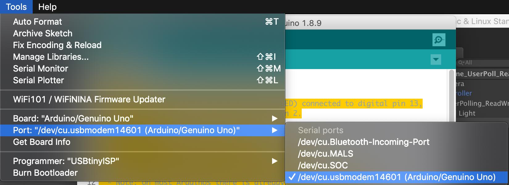
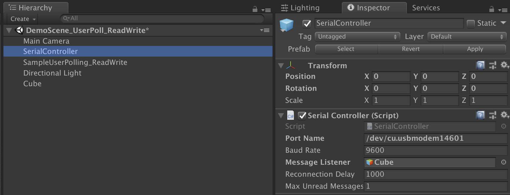

# Arduino-Unity

En este proyecto se realizo una conexión entre un control con 4 botones de colores usando Arduino y Unity, la idea principal es tener una interfaz de comunicación que sirva para hacer diferentes actividades de aprendizaje para niños.

Para la comunicación entre Arduino y Unity se uso el package Ardity que se puede encontrar en el Asset Store de Unity o descargar desde GitHub, gracias de antemano a Daniel Wilches por el desarrollo de Ardity.

Se puede encontrar más información sobre Aridity en los siguientes links:

Web Page: http://ardity.dwilches.com/
GitHub Project: https://github.com/DWilches/Ardity

A continuación vamos a encontrar el código que se utilizo en Arduino para realizar la comunicación, simplemente lo que hace es enviar un mensaje cuando se presiona alguno de los botones, estos mensajes son recibidos en Unity por medio de la función OnMessageArrived y luego los mensajes que llega se usan para activar otra función que con base en el botón presionado genera una acción.

```Java

/*
  Button

  Turns on and off a light emitting diode(LED) connected to digital pin 13,
  when pressing a pushbutton attached to pin 2.

  The circuit:
  - LED attached from pin 13 to ground
  - pushbutton attached to pin 2, 3, 4, 5 from +5V
  - 10K resistor attached to pin 2 from ground

  - Note: on most Arduinos there is already an LED on the board
    attached to pin 13.

  created 2005
  by DojoDave <http://www.0j0.org>
  modified 28 Aprilg 2019
  by Victor Cardona

  This example code is in the public domain.

  http://www.arduino.cc/en/Tutorial/Button
*/
unsigned long last_time = 0;

// constants won't change. They're used here to set pin numbers:
const int buttonPinBlue = 2;     // the number of the pushbutton pin
const int buttonPinRed = 3;
const int buttonPinGreen = 4;
const int buttonPinYellow = 5;
const int ledPin =  13;      // the number of the LED pin

// variables will change:
int buttonStateBlue = 0;         // variable for reading the pushbutton status
int buttonStateRed = 0;         // variable for reading the pushbutton status
int buttonStateGreen = 0;         // variable for reading the pushbutton status
int buttonStateYellow = 0;         // variable for reading the pushbutton status


void setup() 
{

  Serial.begin(9600);

  // initialize the LED pin as an output:
  pinMode(ledPin, OUTPUT);
  // initialize the pushbutton pin as an input:
  pinMode(buttonPinBlue, INPUT);
  pinMode(buttonPinRed, INPUT);
  pinMode(buttonPinGreen, INPUT);
  pinMode(buttonPinYellow, INPUT);

}

void loop() 
{
  // read the state of the pushbutton value:
    buttonStateBlue = digitalRead(buttonPinBlue);
    buttonStateRed = digitalRead(buttonPinRed);
    buttonStateGreen = digitalRead(buttonPinGreen);
    buttonStateYellow = digitalRead(buttonPinYellow);

  // check if the pushbutton is pressed. If it is, the buttonState is HIGH:
  if (buttonStateBlue == HIGH && millis() > last_time + 2000) 
  {
    // turn LED on:
    digitalWrite(ledPin, HIGH);
    Serial.println("1"); // 1 = Blue
    last_time = millis();

  } 

  if (buttonStateRed == HIGH && millis() > last_time + 2000) 
  {
    // turn LED on:
    digitalWrite(ledPin, HIGH);
    Serial.println("2"); // 2 = Red
    last_time = millis();

  }

  if (buttonStateGreen == HIGH && millis() > last_time + 2000) 
  {
    // turn LED on:
    digitalWrite(ledPin, HIGH);
    Serial.println("3"); // 3 = Green
    last_time = millis();

  }

  if (buttonStateYellow == HIGH && millis() > last_time + 2000) 
  {
    // turn LED on:
    digitalWrite(ledPin, HIGH);
    Serial.println("4"); // 4 = Yellow
    last_time = millis();

  }
}
```

Los mensajes que se enviaron desde Arduino a Unity salen como un String pero luego en Unity se convierten a Int, debido a que se presentaban problemas de comunicación y en el Switch donde se trataba de activar la función según el mensaje que llegaba no ocurria nada, debido a esto se tomo la decisión de enviar numeros como String y luego convertirlo a Int usando el siguiente código:

``` C#
public void OnMessageArrived(string msg)
    {
        Debug.Log("Arrived: " + msg);
        Debug.Log(msg);
        CambioColor(msg);
    }

    public void CambioColor(string clave)
    {
        Debug.Log("Función Cambio Color");
        Debug.Log("El mensaje que llego es " + clave);

        int valorEntero = int.Parse(clave);

        switch (valorEntero)
        {
            case 1:
                m_Material.color = Color.blue;
                iTween.ShakeScale(this.gameObject,new Vector3(0.5f,0.5f,0.5f), 2);
                Debug.Log("Parte Blue del Switch");
                break;
            case 2:
                m_Material.color = Color.red;
                iTween.ShakeScale(this.gameObject, new Vector3(0.5f, 0.5f, 0.5f), 2);
                Debug.Log("Parte Red del Switch");
                break;
            case 3:
                m_Material.color = Color.green;
                iTween.ShakeScale(this.gameObject, new Vector3(0.5f, 0.5f, 0.5f), 2);
                Debug.Log("Parte Green del Switch");
                break;
            case 4:
                m_Material.color = Color.yellow;
                iTween.ShakeScale(this.gameObject, new Vector3(0.5f, 0.5f, 0.5f), 2);
                Debug.Log("Parte Yellow del Switch");
                break;
        }
    }

```

Es importante configurar el puerto adecuadamente, tanto en el Arduino como en Unity, para hacerlo vamos al IDE de Arduino y buscamos el puerto en el cual esta conectado y ese mismo nombre lo debemos agregar en Unity.



Luego ese mismo nombre lo agregamos a Unity para que pueda funcionar bien la comunicación entre Arduino y Unity



Todo este ejemplo fue realizado en Mac, pero los mismos pasos se puede seguir en Windows.
